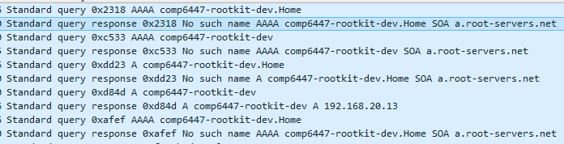

# Rootkit

## Disclaimer
Feel free to contribute is you get something interesting! There's only two of us working on the rootkit. Im Still working on that remote backdoor.
In the meantime, [Designing BSD rootkits PDF](https://github.com/colavs19/bcit-courses/raw/master/COMP%208045%20-%20Major%20Project/Reference%20Documents/Designing%20BSD%20Rootkits%20-%20An%20Introduction%20to%20Kernel%20Hacking.pdf)


## Friendly repos
* [Basic rootkit for FreeBSD OS, written for UNSW COMP6447](https://github.com/orf53975/FreeBSDRootkit_PUBLIC)

## VM
1. FreeBSD, not your usual GNU Linux! Hence,
	* **tcsh** instead of **bash**
2. log:pass : ```comp6447:comp6447```
3. How to connect FreeBSD to your local LAN&NAT, as a real machine?
	* VirtualBox -> comp6447 1 -> settings (with)
	* -> network -> Attached to: "Bridged adapter"
	* -> network -> Name: (your real internet adapter)
	* (make sure you assign a static intranet IP address on the router)

## Recon
### Nmap
Ports found:

Type | N | Service | Desc
--- | --- | --- | ---
TCP | 22 | SSH | Putty
UDP | 123 | NTP | Clock sync

Look at: **UDP | 123 | NTP | Clock sync** ! Seems **very** exploitable! Moreover, because nmap by default never scans UDP ports, it's unlikely this idea will be copied by the other groups

### Wireshark
* Constantly tries to sync time with "0.freebsd.pool.ntp.org" (and others)
* Tries to connect with "comp6447-rootkit-dev.Home" (sic).
    
	
    Host doesn't exist and **can't** exist on the internet (see ```.\recon\dotHome attack``` )

### Other
* One instance of shellshock attack appears possible! Check ```./recon/shellshock.sh```
* Check out the startup video! University of ~~New South Wales~~ California

## Rootkit idea
### Patch OS
1. patch file handling to ignore rootkit
2. patch file handling to return unpatched data for patched executables
    * store patched executables in the sub-file system (i.e. a store archive for example)
3. After **all** patching done, clear all **relevant** logs

### Remote
1. Upon invalid, but correctly-syntaxed input onto NTP 123 (for example, time = 01/01/1950), give shell

### Patch aspects
1. When patching the system files, make sure the jumps/return addr overwritten are made within the normal intended routines
2. Use easy-to-scale programming language, such as Python, Java or GO
	* Todo discuss with the assignment partner
3. Make sure there are **no bugs** (seemingly the easiest danger by far).
